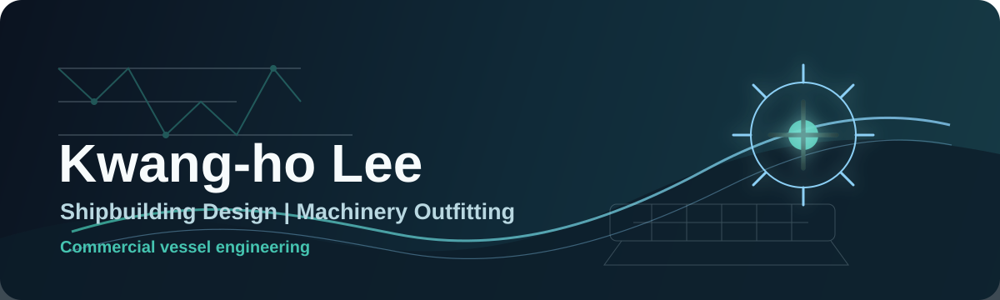

 

 

<table>
  <tr>
    <td>
      <h3>Current</h3>
      

        <strong>Engineer @ Hanwha Ocean</strong> 
        Machinery Outfitting Design Engineering Team 
        Commercial Ship Business Division
      

      

        Designing <strong>engine-room machinery outfitting systems for commercial vessels</strong>, with focus on arrangement, foundations, supports, access structures, and insulation.
      

    </td>
  </tr>
</table>

<table>
  <tr>
    <td>
      <h3>Focus</h3>
      

        
        
        
        
      

      

        Practical shipbuilding design with attention to production, safety, accessibility, and maintainability.
      

    </td>
  </tr>
</table>

## Experience

**Hanwha Ocean**  
Engineer, Machinery Outfitting Design Engineering Team  
`2025.12 - Present`

**Robotics & Intelligent Systems Lab**  
Undergraduate Researcher  
`2023.06 - 2024.02`

**Control Engineering Lab**  
Winter Research Intern  
`2022.12 - 2023.02`

<strong>Academic research background</strong>

- SLAM and autonomous navigation research using ROS2 and Gazebo
- Mobile manipulator dynamics
- Digital twin systems and real-time virtual models
- Python-based data structures and algorithms
- Thermal-fluid design projects

## Toolkit

  
  
  
  
  

## GitHub

  

  

## Personal

`Sim Racing` `Board Games` `Korean` `English`

