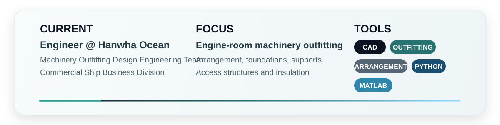

**Mechanical Engineer | Shipbuilding Design | Machinery Outfitting**

 

<a href="https://github.com/mavro7910">GitHub</a> |
<a href="http://www.linkedin.com/in/kwang-ho-lee-95264b281">LinkedIn</a> |
<a href="https://kwangho97.notion.site/Kwang-ho-Lee-2616130943f18018ab76f41ac07a80eb">Portfolio</a> |
<a href="mailto:kwangho97@g.skku.edu">Email</a>

---

## Work

- Engine-room machinery outfitting design for commercial vessels
- Arrangement coordination with safety, accessibility, and maintainability in mind
- Foundations, supports, access structures, insulation, and related outfitting elements

## Experience

**Hanwha Ocean**  
Engineer, Machinery Outfitting Design Engineering Team  
`2025.12 - Present`

**Robotics & Intelligent Systems Lab**  
Undergraduate Researcher  
`2023.06 - 2024.02`

**Control Engineering Lab**  
Winter Research Intern  
`2022.12 - 2023.02`

<strong>Academic research background</strong>

- SLAM and autonomous navigation research using ROS2 and Gazebo
- Mobile manipulator dynamics
- Digital twin systems and real-time virtual models
- Python-based data structures and algorithms
- Thermal-fluid design projects

## Tools

`CAD` `Machinery Outfitting` `Arrangement Design` `Mechanical Design` `Python` `MATLAB`

## Activity

